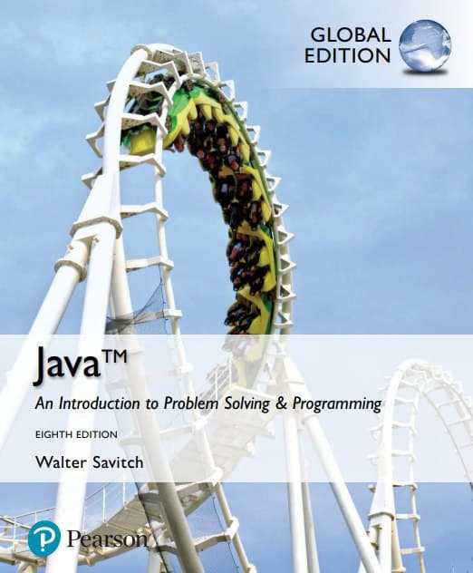
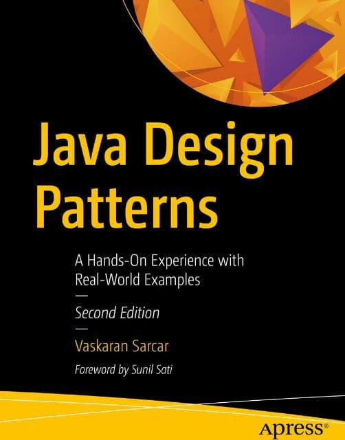
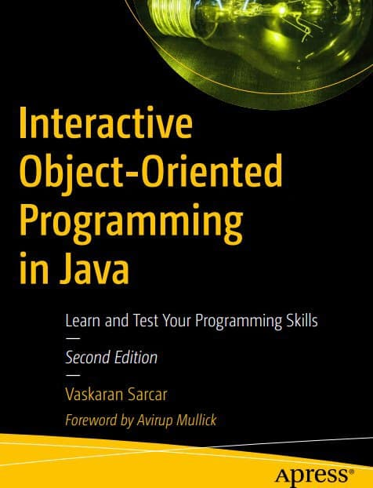
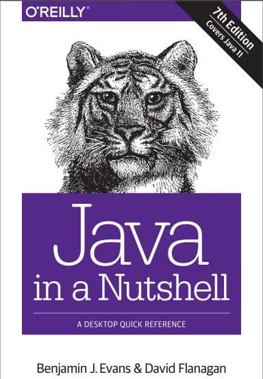
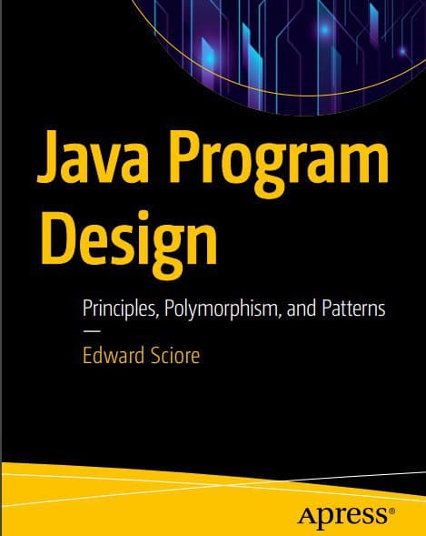
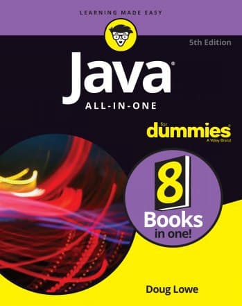
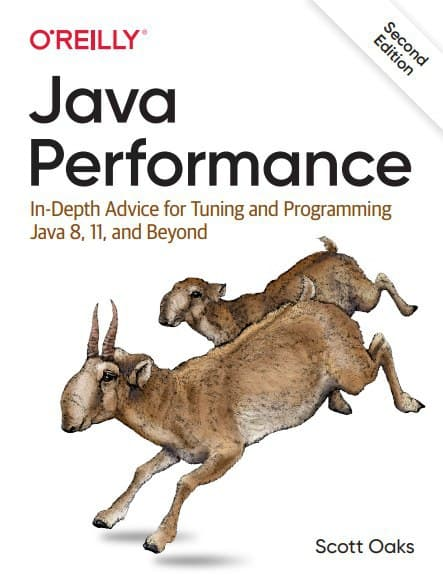

# 🎯💻Competitive Programming Question Bank🏆🏅
This repository contains all the popular Competitive Programming questions and Interview questions. The Programming languages used for demonstration are the C Language, C++, Python, Java and JavaScript.   
 
 
 
 
 
   

## 📝Popular Questions:
<ul>
 <li><a href="https://github.com/smv1999/CompetitiveProgrammingQuestionBank/tree/master/2D%20Arrays">2D Arrays</a></li>
 <li><a href="https://github.com/smv1999/CompetitiveProgrammingQuestionBank/tree/master/Arrays">Arrays</a></li>
 <li><a href="https://github.com/smv1999/CompetitiveProgrammingQuestionBank/tree/master/Backtracking">Backtracking</a></li>
 <li><a href="https://github.com/smv1999/CompetitiveProgrammingQuestionBank/tree/master/CodeVita%20Problems">CodeVita Problems</a></li>
 <li><a href="https://github.com/smv1999/CompetitiveProgrammingQuestionBank/tree/master/DSA%20450%20GFG">DSA 450 GFG</a></li>
 <li><a href="https://github.com/smv1999/CompetitiveProgrammingQuestionBank/tree/master/Data%20Structures">Data Structures</a></li>
 <li><a href="https://github.com/smv1999/CompetitiveProgrammingQuestionBank/tree/master/Divide%20and%20Conquer">Divide and Conquer</a></li>
 <li><a href="https://github.com/smv1999/CompetitiveProgrammingQuestionBank/tree/master/Dynamic%20Programming">Dynamic Programming</a></li>
 <li><a href="https://github.com/smv1999/CompetitiveProgrammingQuestionBank/tree/master/GCD%20of%20two%20numbers">GCD of two Numbers</a></li>
 <li><a href="https://github.com/smv1999/CompetitiveProgrammingQuestionBank/tree/master/Games">Games</a></li>
 <li><a href="https://github.com/smv1999/CompetitiveProgrammingQuestionBank/tree/master/General%20Questions">General Questions</a></li>
 <li><a href="https://github.com/smv1999/CompetitiveProgrammingQuestionBank/tree/master/Greedy">Greedy</a></li>
 <li><a href="https://github.com/smv1999/CompetitiveProgrammingQuestionBank/tree/master/Hackerrank%20solutions">HackerRank Solutions</a></li>
 <li><a href="https://github.com/smv1999/CompetitiveProgrammingQuestionBank/tree/master/Hashing">Hashing</a></li>
 <li><a href="https://github.com/smv1999/CompetitiveProgrammingQuestionBank/tree/master/Numbers">Numbers</a></li>
 <li><a href="https://github.com/smv1999/CompetitiveProgrammingQuestionBank/tree/master/OOPs">OOPs</a></li>
 <li><a href="https://github.com/smv1999/CompetitiveProgrammingQuestionBank/tree/master/Passwords">Passwords</a></li>
 <li><a href="https://github.com/smv1999/CompetitiveProgrammingQuestionBank/tree/master/Recursion">Recursion</a></li>
 <li><a href="https://github.com/smv1999/CompetitiveProgrammingQuestionBank/tree/master/Searching%20Algorithms">Searching Algorithms</a></li>
 <li><a href="https://github.com/smv1999/CompetitiveProgrammingQuestionBank/tree/master/Sorting%20Algorithms">Sorting Algorithms</a></li>
 <li><a href="https://github.com/smv1999/CompetitiveProgrammingQuestionBank/tree/master/Standard%20Template%20Library">Standard Template Library</a></li>
 <li><a href="https://github.com/smv1999/CompetitiveProgrammingQuestionBank/tree/master/Strings">Strings</a></li>
</ul>

## **📚Library**

  

<b>Java</b>
 
   
  | | ||||
  |----|----|----|----|----|
  |Java-An Intro|Java 8 Tutorial|Design Patterns|OOP in Java|Complete Ref.11|
  ||||||
  |Java CookBook|J in a Nutshell|Program Design|Java all-in-one|Java Performance|

  

## 💥 How to Contribute?
Head over to [Contributing Guidelines](https://github.com/smv1999/CompetitiveProgrammingQuestionBank/blob/master/CONTRIBUTING.md) to know more!

## Project Admin

|                                                                           |
| :-----------------------------------------------------------------------------------------------------------------------------------------------------------------------------------------------------------------------------------------------------------------: |
|                                                                                      **[Vaidhyanathan S M](https://www.linkedin.com/in/vaidhyanathansm/)**                                                                                    |

*Need help? Feel free to contact me @ vaidhyanathan.sm@gmail.com*

## Programs 

DevIncept is a 30 day open source program helping the student community learn and contribute in various open source projects under the guidance of skilled mentors and project admins.

## ✨ Acknowledgement
Thanks to all the [contributors](https://github.com/smv1999/CompetitiveProgrammingQuestionBank/blob/master/CONTRIBUTORS.md) for all their contributions.

## Stargazers Over Time 

## LICENSE
This project follows the [MIT License](https://github.com/smv1999/CompetitiveProgrammingQuestionBank/blob/master/LICENSE).
